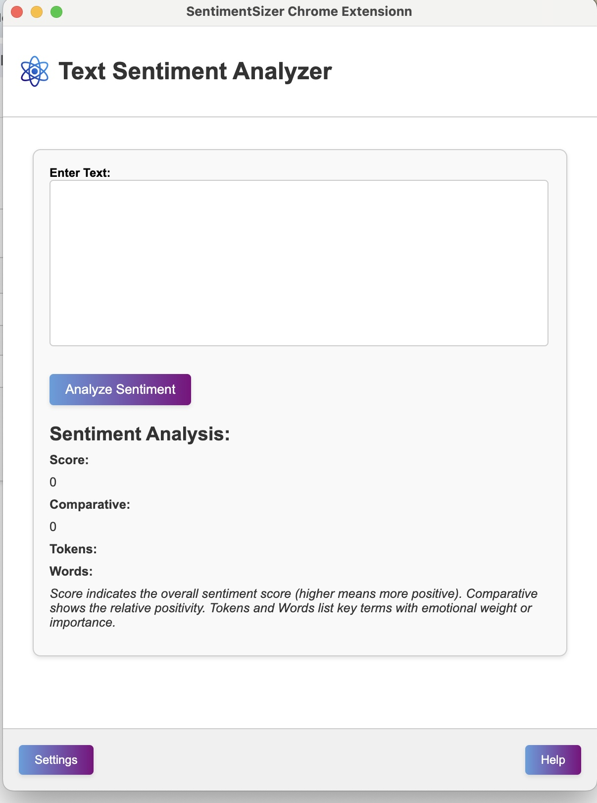
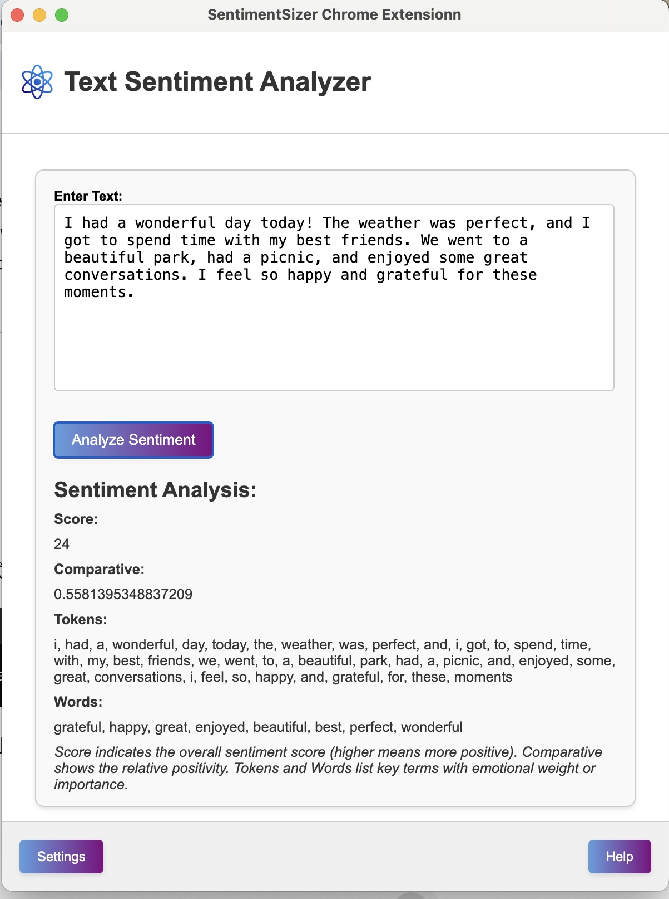

## SentimentSizer Chrome Extensionn

## Description
This Chrome extension combines AI-powered text sentiment analysis with the ability to conveniently resize the popup window for enhanced usability.

  
  
  

## Features
**Text Sentiment Analysis:** Utilizes advanced AI algorithms to analyze the sentiment of text, categorizing it as positive, negative, or neutral.
**Resize popup window:** Navigate to the 'Settings' page through the 'Settings' button, where you can specify the desired height and width for the popup window. Save your settings to see the changes applied the next time you open the extension.

## Technologies Used
- **Framework:** Next.js
- **Languages:** TypeScript, HTML, CSS
- **Libraries/Tools:** React, Chrome API

## Installation
To install and run the project locally, follow these steps:

1. Clone the repository: `git clone https://github.com/JamieL527/SentimentSizer-Chrome-Extensionn.git`
2. Navigate to the project directory.
3. Install dependencies: `npm install`

## Usage
### Development:
- Run the development server: `npm run dev`
- Make changes and see updates in real-time.

### Build:
- Generate a production build:`npm run build`
- This will create optimized files in the `out` directory.

## Load Extension
To load the extension in Chrome:

1. Open Chrome.
2. Go to `chrome://extensions/`.
3. Enable developer mode.
4. Click on "Load unpacked" and select the `out` directory.

## License
This project is licensed under the MIT License - see the [LICENSE](LICENSE) file for details.
